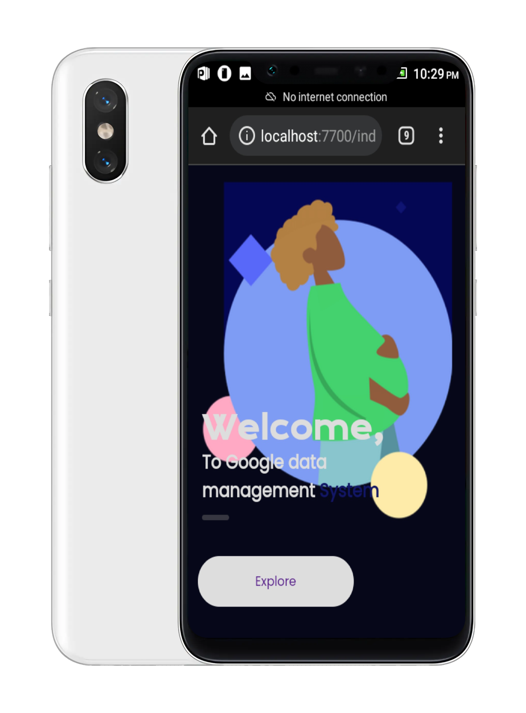

### Hi there 👋, my name is Abdul Basit Ajaga

#### I am the code ninja 💻💻🤗🤗

I am a web developer with the simplest aim of creating real world user experience and solving real world problem. I love coding alot no wonder am called the code ninja 😎.

Skills: REACT NATIVE /  REACT / DJANGO/ TYPESCRIPT/JS / HTML / CSS/SCSS

- 🔭 I’m currently working on reviewexpert.netlify.app 

- 🌱 I’m currently learning React native 

- 👯 I’m looking to collaborate on Any interesting problem & projects 

- 💬 Ask me about React Js / Django / React native / Javascript 

- 📫 How to reach me: basitng.com 

- 😄 Pronouns: Ajaga

- ⚡ Fun fact: I love eating 

- ⚾ Hobby: I love playing football
### My projects.
(https://github.com/basitng/Budget-app)[]

(https://github.com/basitng)              

<!--
**basitng/basitng** is a ✨ _special_ ✨ repository because its `README.md` (this file) appears on your GitHub profile.

Here are some ideas to get you started:

- 🔭 I’m currently working on ...
- 🌱 I’m currently learning ...
- 👯 I’m looking to collaborate on ...
- 🤔 I’m looking for help with ...
- 💬 Ask me about ...
- 📫 How to reach me: ...
- 😄 Pronouns: ...
- ⚡ Fun fact: ...
-->
